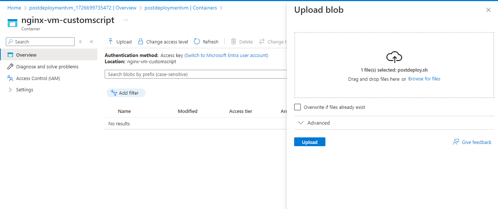
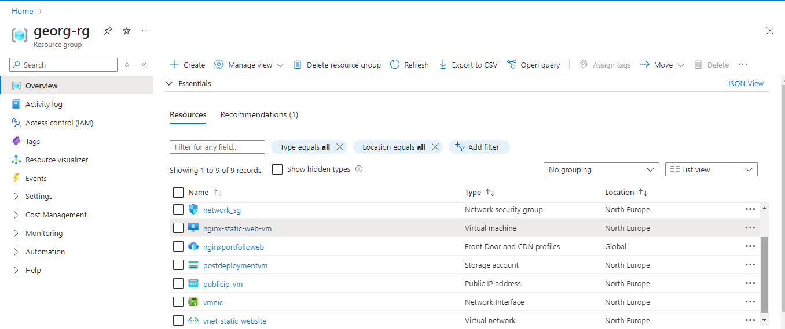
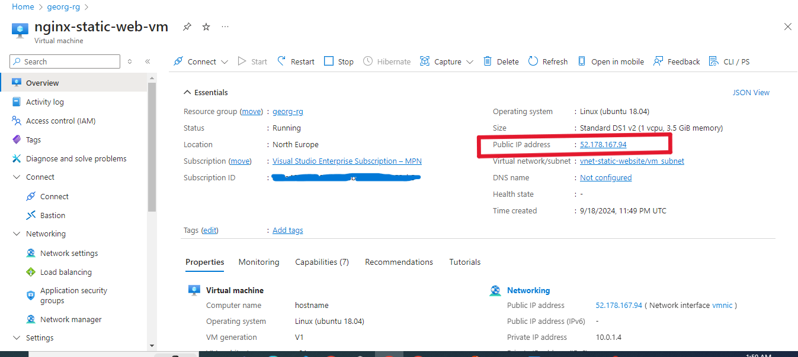
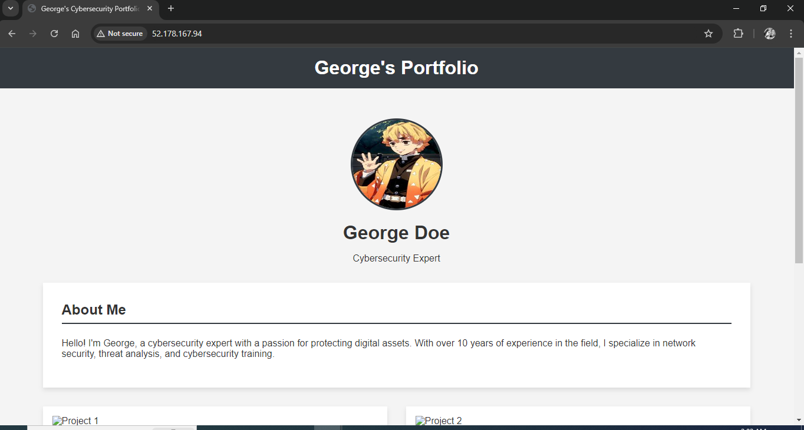

# Static Website Deployment on Azure Virtual Machine using Terraform

This repository contains documentation for provisioning a static website using an Azure Virtual Machine (VM). The infrastructure is created using Infrastructure as Code (IaC) with Terraform, and the website is served using the Nginx web server installed via a custom bash script on the VM.

## Architecture Overview

The infrastructure consists of:

- A Virtual Network (VNet) with a Subnet
- A Network Interface connected to the subnet
- A Virtual Machine provisioned with a Public IP
- A Network Security Group (NSG) allowing HTTP (port 80) traffic
- Azure Front Door service to provide a frontend to the VM Public IP
- A bash script hosted on Azure Blob Storage to automatically install and configure Nginx on the VM

## Prerequisites

- An Azure account
- Terraform installed on your machine
- Bash script for Nginx installation stored in Azure Blob Storage with a Shared Access Signature (SAS)

## Step-by-Step Process

### 1. Creating Storage Account and Uploading Script

First, create an Azure storage account and a blob container. Upload a bash script to the container, which will install Nginx on the virtual machine. This script is retrieved during VM provisioning.

              *Figure 1: Creating a Storage Account on Azure (LRS) .*

*Figure 2: Creating a Container in Storage Account .*

*Figure 3: Bash file upload .*

Once the script is uploaded, generate a Shared Access Signature (SAS) URI for the file to grant Terraform temporary access to the file.

*Figure 4: Generate SAS.*

### 2. Terraform Configuration

The Terraform code is split into the following files for better modularity and readability:

- **provider.tf**: Specifies the Azure provider for Terraform.
- **resource_group.tf**: To use the resource group where all resources will reside.
- **network.tf**: Defines the Virtual Network and Subnet.
- **nic.tf**: Defines the network interface that connects the VM to the virtual network.
- **virtual_machine.tf**: Provisions the virtual machine and uses the bash script stored in Azure Blob Storage to install Nginx.
- **output.tf**: Outputs the public IP of the VM, allowing easy access to the static website.
- **front_door.tf**: Provisions Azure Front Door to front the public IP of the VM.

3. Running Terraform Commands
After configuring the Terraform files, run the following commands:
- ``terraform init``
- ``terraform validate``
- ``terraform apply``
  
  
  *Figure 5: Terraform apply complete.*

  
  *Figure 6: Terraform config result.*
  
## 4. Access the Static Website

Once Terraform completes the process, the public IP of the VM will be available in the output. Open the browser and navigate to the public IP to access the static website served by Nginx.

*Figure 7: VM IP.*
  

*Figure 8: Website access from VM IP.*

## 5. Azure Front Door Configuration

Azure Front Door will be set up to front the public IP of the VM, allowing traffic management and enhanced security for the static website.

*Figure 8: Azure Front Door frontend endpoint.*

*Figure 9: Website access from Azure Front Door .*

